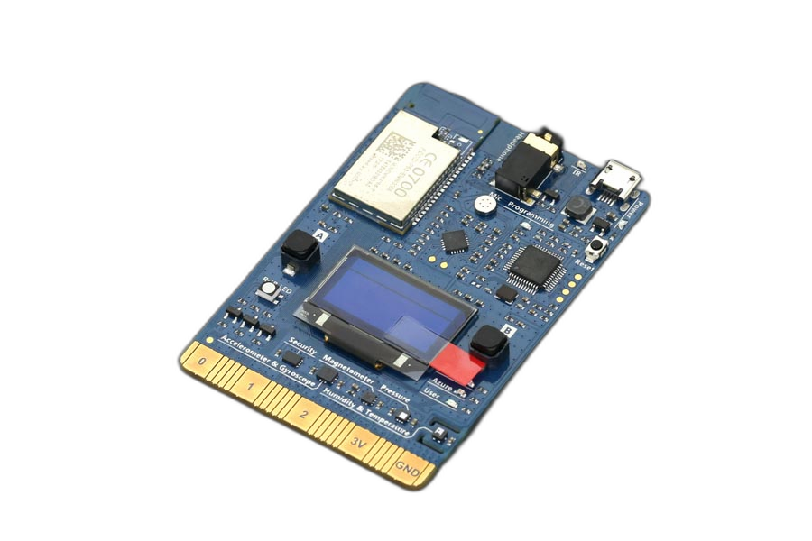

# MXChip AZ3166 IoT DevKit SDK (Community Fork)

[](https://opensource.org/licenses/MIT)

A community-maintained fork of the [Microsoft Azure IoT DevKit SDK](https://github.com/microsoft/devkit-sdk) for the MXChip AZ3166 IoT DevKit, optimized for **PlatformIO** and general-purpose IoT development.

> **Note**: The original Microsoft SDK was archived in April 2023 and devices can no longer connect to Azure IoT Hub using the built-in libraries. This fork removes deprecated Azure IoT Hub dependencies and adds modern TLS/MQTT capabilities.

---

## Table of Contents

- [About the Hardware](#about-the-hardware)
- [What's Changed](#whats-changed)
- [Framework Features](#framework-features)
- [Sample Projects](#sample-projects)
- [Getting Started](#getting-started)
- [Changelog](#changelog)
- [License](#license)

---

## About the Hardware



The **MXChip AZ3166 IoT DevKit** features ARM Cortex-M processors with:

| Component | Details |
|-----------|---------|
| **Processor** | ST Microelectronics STM32F412
| **WiFi** | Cypress BCM43362
| **Display** | 128×64 OLED screen |
| **Audio** | Headphone/speaker output, stereo microphone |
| **Sensors** | Humidity, temperature, pressure, accelerometer, gyroscope, magnetometer |
| **Buttons** | A, B, and Reset |
| **LEDs** | RGB LED, user LED, WiFi LED |
| **Secure Storage** | STSAFE-A100 secure element with multiple storage zones |

### Architecture Diagram

```
┌────────────────────────────────────────────────────────────────┐
│                          Your Sketch                           │
│              setup() / loop() — Application Code               │
├────────────────────────────────────────────────────────────────┤
│                    Arduino Framework Layer                     │
│ ┌──────────────────┐ ┌──────────────────┐ ┌──────────────────┐ │
│ │   DeviceConfig   │ │  SensorManager   │ │ WiFiClientSecure │ │
│ └──────────────────┘ └──────────────────┘ └──────────────────┘ │
│ ┌──────────────────┐ ┌──────────────────┐ ┌──────────────────┐ │
│ │     AzureIoT     │ │   PubSubClient   │ │    HTTPClient    │ │
│ └──────────────────┘ └──────────────────┘ └──────────────────┘ │
│ ┌──────────────────┐ ┌──────────────────┐ ┌──────────────────┐ │
│ │    HTTPServer    │ │    NTPClient     │ │   OLEDDisplay    │ │
│ └──────────────────┘ └──────────────────┘ └──────────────────┘ │
│      Digital/Analog I/O · Serial · Interrupts · Watchdog       │
├────────────────────────────────────────────────────────────────┤
│                         Platform Layer                         │
│ ┌──────────────────┐ ┌──────────────────┐ ┌──────────────────┐ │
│ │   mbed OS 5.4    │ │    MiCO WiFi     │ │     mbedTLS      │ │
│ │    RTOS · HAL    │ │     EMW10xx      │ │   TLS 1.1/1.2    │ │
│ │     Drivers      │ │    lwIP Stack    │ │   X.509 · SAS    │ │
│ └──────────────────┘ └──────────────────┘ └──────────────────┘ │
├────────────────────────────────────────────────────────────────┤
│                            Hardware                            │
│  ┌──────────────────────────────────────────────────────────┐  │
│  │            STM32F412 (ARM Cortex-M4, 96 MHz)             │  │
│  │       Flash: 976 KB app · RAM: 256 KB · RTC · IWDG       │  │
│  └──────────────────────────────────────────────────────────┘  │
│ ┌────────────┐  ┌────────────┐  ┌────────────┐  ┌────────────┐ │
│ │  BCM43362  │  │STSAFE-A100 │  │  NAU88C10  │  │128×64 OLED │ │
│ │ WiFi SDIO  │  │ Secure I2C │  │   Audio    │  │SSD1306 I2C │ │
│ └────────────┘  └────────────┘  └────────────┘  └────────────┘ │
│ ┌────────────┐  ┌────────────┐  ┌────────────┐  ┌────────────┐ │
│ │   HTS221   │  │  LPS22HB   │  │  LSM6DSL   │  │  LIS2MDL   │ │
│ │ Temp/Humid │  │  Pressure  │  │ Accel/Gyro │  │Magnetometer│ │
│ └────────────┘  └────────────┘  └────────────┘  └────────────┘ │
│   Buttons (A, B, Reset) · RGB LED · User LED · WiFi LED        │
│   SPI · I2C · UART · USB · IrDA · QSPI Flash                   │
└────────────────────────────────────────────────────────────────┘
```

---

## What's Changed

This fork includes significant modifications from the original SDK:

### Removed

| Component | Reason |
|-----------|--------|
| **Azure IoT Hub libraries** | The original built in libraries are outdated; devices can no longer connect |
| **Board telemetry collector** | Defunct Microsoft telemetry service |
| **Built-in MQTT library** | Original Paho library Did not support mTLS connections |

### Added

| Feature | Description |
|---------|-------------|
| **WiFiClientSecure** | Arduino-compatible TLS client for use with any MQTT library (e.g., PubSubClient) |
| **TLSSocket improvements** | Revamped the TLS socket layer to remediate bugs, etc when using MQTT mTLS (see [TLSPATCH.md](docs/TLSPATCH.md)) |
| **Connection Profiles** | Pre-defined connection profiles for MQTT, Azure IoT Hub, and Azure DPS |
| **DeviceConfig System** | Unified configuration storage with multi-zone support for large certificates |
| **SensorManager** | Simple API for all onboard sensors (temperature, humidity, pressure, IMU, magnetometer) |
| **AzureIoT Library** | Complete Azure IoT Hub client with DPS provisioning, SAS token generation, and Device Twin support |
| **PubSubClient Library** | Bundled MQTT client library (Nick O'Leary, MIT license) — no external lib_deps needed |
| **Updated Web Configuration UI** | Browser-based setup via WiFi AP mode |
| **Input Validation** | Centralized validation for URLs, certificates, and connection strings |
| **Updated CLI commands** | Extensible serial commands for all configuration settings |

---

## Framework Features

The framework provides several key abstractions that simplify building IoT projects:

### Connection Profiles

The SDK supports multiple connection profiles that determine which settings are available and how EEPROM zones are allocated:

| Profile | Description | Settings |
|---------|-------------|----------|
| `PROFILE_NONE` | No EEPROM - config in code | None |
| `PROFILE_MQTT_USERPASS` | Basic MQTT | WiFi, Broker URL, Device ID, Password |
| `PROFILE_MQTT_USERPASS_TLS` | MQTT over TLS | WiFi, Broker URL, Device ID, Password, CA Cert |
| `PROFILE_MQTT_MTLS` | MQTT with mutual TLS | WiFi, Broker URL, CA Cert, Client Cert, Client Key |
| `PROFILE_IOTHUB_SAS` | Azure IoT Hub (SAS) | WiFi, Connection String |
| `PROFILE_IOTHUB_CERT` | Azure IoT Hub (X.509) | WiFi, Connection String, Device Cert |
| `PROFILE_DPS_SAS` | Azure DPS (Symmetric Key) | WiFi, DPS Endpoint, Scope ID, Registration ID, Symmetric Key |
| `PROFILE_DPS_SAS_GROUP` | Azure DPS (Group SAS) | WiFi, DPS Endpoint, Scope ID, Registration ID, Symmetric Key |
| `PROFILE_DPS_CERT` | Azure DPS (X.509) | WiFi, DPS Endpoint, Scope ID, Registration ID, Device Cert |
| `PROFILE_CUSTOM` | User-defined ([see guide](docs/CustomProfile.md)) | Defined in your project's `custom_profile.h` |

See [Getting Started](docs/GettingStarted.md#step-3-choose-a-connection-profile) for guidance on choosing a profile and configuring `platformio.ini`.

### DeviceConfig

The `DeviceConfig` system provides unified access to configuration stored in the STSAFE secure element. Configuration is loaded automatically at startup based on your connection profile.

```cpp
#include <DeviceConfig.h>

// WiFi credentials
const char* ssid = DeviceConfig_GetWifiSsid();
const char* password = DeviceConfig_GetWifiPassword();

// MQTT/TLS settings
const char* host = DeviceConfig_GetBrokerHost();
int port = DeviceConfig_GetBrokerPort();
const char* caCert = DeviceConfig_GetCACert();
const char* clientCert = DeviceConfig_GetClientCert();
const char* clientKey = DeviceConfig_GetClientKey();

// Device identity (extracted from cert CN or connection string)
const char* deviceId = DeviceConfig_GetDeviceId();
```

### SensorManager

The `Sensors` global provides easy access to all onboard sensors. It's initialized automatically at startup.

```cpp
#include <SensorManager.h>

// Individual readings
float temp = Sensors.getTemperature();      // °C
float humidity = Sensors.getHumidity();     // %RH
float pressure = Sensors.getPressure();     // hPa

// Motion sensors
int32_t ax, ay, az;
Sensors.getAccelerometer(ax, ay, az);       // mg

int32_t gx, gy, gz;
Sensors.getGyroscope(gx, gy, gz);           // mdps

int32_t mx, my, mz;
Sensors.getMagnetometer(mx, my, mz);        // mGauss

// Read all sensors at once
SensorData data = Sensors.readAll();

// Generate JSON telemetry
char json[512];
Sensors.toJson(json, sizeof(json));
```

| Sensor | Measurements | Units |
|--------|--------------|-------|
| HTS221 | Temperature, Humidity | °C, %RH |
| LPS22HB | Barometric Pressure | hPa |
| LSM6DSL | Accelerometer, Gyroscope | mg, mdps |
| LIS2MDL | Magnetometer | mGauss |

### PubSubClient (MQTT)

The bundled `PubSubClient` library pairs with `WiFiClientSecure` for secure MQTT connections to any broker. Credentials and certificates are loaded from EEPROM via DeviceConfig.

```cpp
#include <AZ3166WiFi.h>
#include <AZ3166WiFiClientSecure.h>
#include <PubSubClient.h>
#include <DeviceConfig.h>

WiFiClientSecure wifiClient;
PubSubClient mqtt(wifiClient);

void callback(char* topic, byte* payload, unsigned int len) {
    Serial.printf("Message on %s: %.*s\n", topic, len, payload);
}

void setup() {
    Serial.begin(115200);
    WiFi.begin(DeviceConfig_GetWifiSsid(), DeviceConfig_GetWifiPassword());
    while (WiFi.status() != WL_CONNECTED) delay(500);

    // Configure TLS from stored certificates
    wifiClient.setCACert(DeviceConfig_GetCACert());
    wifiClient.setCertificate(DeviceConfig_GetClientCert());
    wifiClient.setPrivateKey(DeviceConfig_GetClientKey());

    mqtt.setServer(DeviceConfig_GetBrokerHost(), DeviceConfig_GetBrokerPort());
    mqtt.setCallback(callback);
}

void loop() {
    if (!mqtt.connected()) {
        mqtt.connect(DeviceConfig_GetDeviceId());
        mqtt.subscribe("commands/#");
    }
    mqtt.publish("telemetry", Sensors.toJson());
    mqtt.loop();
    delay(5000);
}
```

### AzureIoT Library

The `AzureIoT` library provides a complete Azure IoT Hub client with DPS provisioning support. It handles credential loading, SAS token generation, MQTT connection management, telemetry, C2D messages, and Device Twin operations. Select a connection profile via build flags and the library handles everything else.

```cpp
#include <AzureIoTHub.h>

void onC2D(const char* topic, const char* payload, unsigned int len) {
    Serial.println(payload);
}

void setup() {
    WiFi.begin();  // credentials from EEPROM

    azureIoTInit();       // loads config, provisions via DPS if needed
    azureIoTConnect();    // connects to IoT Hub over MQTT
    azureIoTSetC2DCallback(onC2D);
}

void loop() {
    azureIoTLoop();       // process MQTT messages
    azureIoTSendTelemetry("{\"temp\":25.3}");
    delay(10000);
}
```

The library is split into focused modules:

| Module | Purpose |
|--------|---------|
| `AzureIoTHub.h/.cpp` | Public API — init, connect, telemetry, twin, callbacks |
| `AzureIoTDPS.h/.cpp` | Device Provisioning Service registration over MQTT |
| `AzureIoTCrypto.h/.cpp` | SAS token generation, HMAC-SHA256, group key derivation |
| `AzureIoTConfig.h` | Protocol constants and Azure root CA certificate |

---

## Sample Projects

These complete sample projects demonstrate the framework capabilities:

### [MXChipSecureMQTTDemo](https://github.com/howardginsburg/MXChipSecureMQTTDemo)

A demonstration of mutual TLS (mTLS) MQTT connectivity using X.509 client certificate authentication. This project showcases bidirectional publish/subscribe support with real sensor telemetry (temperature, humidity, pressure) sent as JSON every 5 seconds. Features include automatic WiFi/MQTT reconnection, OLED display for status and readings, and RGB LED indicators for connection state. Includes comprehensive setup instructions for Azure Event Grid MQTT broker with client certificate authentication.

### [MXChipIoTHubDemo](https://github.com/howardginsburg/MXChipIoTHubDemo)

A pure MQTT implementation for connecting to Azure IoT Hub without requiring the deprecated Azure SDK that was a part of the original framework. Uses the framework's built-in AzureIoT library for direct MQTT communication with full IoT Hub functionality: Device-to-Cloud (D2C) telemetry, Cloud-to-Device (C2D) message receiving, and Device Twin support for reported/desired properties. Supports individual and group enrollment via DPS with automatic device key derivation. This lightweight approach demonstrates how to implement Azure IoT Hub connectivity using standard MQTT topics and SAS token authentication.

---

## Getting Started

For installation, device configuration, your first sketch, and detailed usage of the CLI, Web UI, and WiFiClientSecure, see the **[Getting Started Guide](docs/GettingStarted.md)**.

Quick setup:

```ini
[env:mxchip_az3166]
platform = ststm32
board = mxchip_az3166
framework = arduino

build_flags =
    -DCONNECTION_PROFILE=PROFILE_MQTT_MTLS

platform_packages =
    framework-arduinostm32mxchip@https://github.com/howardginsburg/framework-arduinostm32mxchip.git
```

---

## Changelog

See [CHANGELOG.md](CHANGELOG.md) for the full release history and version notes. To pin a specific release in your project, reference a tag:

```ini
platform_packages =
    framework-arduinostm32mxchip @ https://github.com/howardginsburg/framework-arduinostm32mxchip/archive/refs/tags/v2.1.0.zip
```

---

## Documentation

For detailed API documentation covering all bundled libraries, guides on custom connection profiles, the boot sequence, and TLS modifications, see the [docs](docs/README.md) directory.

---

## License

This project is licensed under the MIT License - see the original [Microsoft devkit-sdk](https://github.com/microsoft/devkit-sdk) for details.

Portions of this code are Copyright (c) Microsoft Corporation.