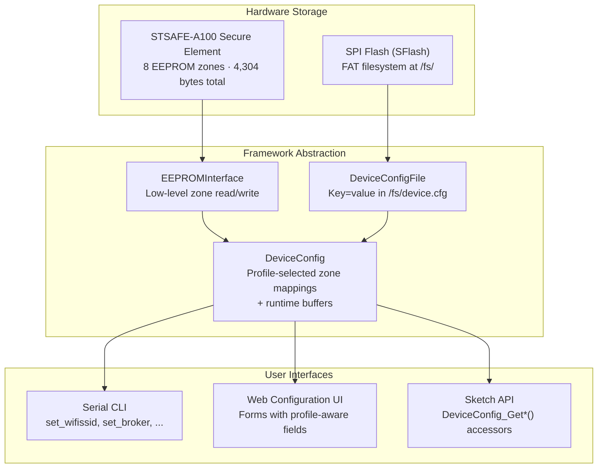

# Device Configuration

Profile-based configuration system for managing device credentials and connection settings. Stores data in STSAFE-A100 EEPROM zones with validation, CLI commands, and web UI metadata.

> **Source:** [cores/arduino/config/](../../cores/arduino/config/)

---

## Overview

The DeviceConfig system provides:
- **Connection profiles** — predefined configurations for MQTT, Azure IoT Hub, and DPS
- **Zone mapping** — maps logical settings to physical EEPROM zones or to the SFlash config file
- **Config-file backed settings** — three operational settings (`SETTING_SEND_INTERVAL`, `SETTING_PUBLISH_TOPIC`, `SETTING_SUBSCRIBE_TOPIC`) stored in `/fs/device.cfg` on the onboard SFlash FAT filesystem, enabling unlimited expansion beyond fixed EEPROM zones
- **Validation** — format and length checks for all setting types
- **CLI integration** — serial commands for reading/writing settings
- **Web UI metadata** — labels, placeholders, and field types for the config web server

---

## Architecture

The configuration system is a layered storage abstraction that routes logical settings to physical storage — either STSAFE EEPROM zones or the SFlash config file — based on the active connection profile.



**Data flow:** At boot, `DeviceConfig_Init(CONNECTION_PROFILE)` selects the active profile, which defines a mapping table from `SettingID` values to physical storage locations. `DeviceConfig_LoadAll()` then reads all mapped zones (EEPROM and config file) into static RAM buffers. The CLI, web UI, and accessor functions all operate on these buffers and write back through the same mapping.

### When to Use EEPROMInterface Directly

Almost never. `DeviceConfig` handles zone selection, multi-zone spanning, file-backed routing, and validation automatically. Direct `EEPROMInterface` access is only appropriate for:

- **Diagnostics** — dumping raw zone contents for debugging
- **Factory provisioning tools** — bulk-writing zones outside the normal profile flow
- **Custom storage** beyond the 17 `SettingID` slots (rare — consider file-backed settings first)

> **Warning:** Writing directly to a zone that the active profile also manages will corrupt the corresponding `DeviceConfig` setting. Always check the active profile's zone assignments before using `EEPROMInterface` directly.

---

## Connection Profiles

| Profile | Value | Description |
|---------|-------|-------------|
| `PROFILE_NONE` | 0 | No EEPROM — sketch provides all config |
| `PROFILE_MQTT_USERPASS` | 1 | MQTT with username/password |
| `PROFILE_MQTT_USERPASS_TLS` | 2 | MQTT with username/password over TLS |
| `PROFILE_MQTT_MTLS` | 3 | MQTT with mutual TLS |
| `PROFILE_IOTHUB_SAS` | 4 | Azure IoT Hub with SAS key |
| `PROFILE_IOTHUB_CERT` | 5 | Azure IoT Hub with X.509 certificate |
| `PROFILE_DPS_SAS` | 6 | Azure DPS with symmetric key (individual) |
| `PROFILE_DPS_CERT` | 7 | Azure DPS with X.509 certificate |
| `PROFILE_DPS_SAS_GROUP` | 8 | Azure DPS with symmetric key (group) |
| `PROFILE_CUSTOM` | 9 | User-defined profile |

Set the active profile at compile time:
```cpp
#define CONNECTION_PROFILE PROFILE_IOTHUB_SAS
```

---

## Setting IDs

| Setting | Description |
|---------|-------------|
| `SETTING_WIFI_SSID` | WiFi network name |
| `SETTING_WIFI_PASSWORD` | WiFi password |
| `SETTING_BROKER_URL` | MQTT broker URL |
| `SETTING_DEVICE_ID` | Device identifier |
| `SETTING_DEVICE_PASSWORD` | Device password |
| `SETTING_CA_CERT` | CA certificate (PEM) |
| `SETTING_CLIENT_CERT` | Client certificate (PEM) |
| `SETTING_CLIENT_KEY` | Client private key (PEM) |
| `SETTING_CONNECTION_STRING` | Azure IoT Hub connection string |
| `SETTING_DPS_ENDPOINT` | DPS endpoint URL |
| `SETTING_SCOPE_ID` | DPS scope ID |
| `SETTING_REGISTRATION_ID` | DPS registration ID |
| `SETTING_SYMMETRIC_KEY` | Symmetric key |
| `SETTING_DEVICE_CERT` | Device certificate (PEM) |
| `SETTING_SEND_INTERVAL` | Message send interval in seconds (config file) |
| `SETTING_PUBLISH_TOPIC` | MQTT publish topic (config file) |
| `SETTING_SUBSCRIBE_TOPIC` | MQTT subscribe topic (config file) |

---

## Core API

```cpp
#include "config/DeviceConfig.h"
```

| Function | Description |
|----------|-------------|
| `void DeviceConfig_Init(ConnectionProfile profile)` | Initialize config system for a profile |
| `const char* DeviceConfig_GetProfileName(void)` | Get active profile name string |
| `ConnectionProfile DeviceConfig_GetActiveProfile(void)` | Get active profile enum value |
| `bool DeviceConfig_IsSettingAvailable(SettingID setting)` | Check if setting exists in active profile |
| `int DeviceConfig_GetMaxLen(SettingID setting)` | Max length for setting (-1 if unavailable) |
| `int DeviceConfig_Save(SettingID setting, const char *value)` | Save setting to EEPROM (0 = success) |
| `int DeviceConfig_Read(SettingID setting, char *buffer, int bufferSize)` | Read setting from EEPROM |
| `bool DeviceConfig_LoadAll(void)` | Load all settings into internal buffers |

### Accessor Functions

| Function | Description |
|----------|-------------|
| `const char* DeviceConfig_GetWifiSsid(void)` | Get WiFi SSID |
| `const char* DeviceConfig_GetWifiPassword(void)` | Get WiFi password |
| `const char* DeviceConfig_GetDevicePassword(void)` | Get device password (MQTT_USERPASS profiles) |
| `const char* DeviceConfig_GetBrokerHost(void)` | Get broker hostname |
| `int DeviceConfig_GetBrokerPort(void)` | Get broker port |
| `const char* DeviceConfig_GetCACert(void)` | Get CA certificate |
| `const char* DeviceConfig_GetClientCert(void)` | Get client certificate |
| `const char* DeviceConfig_GetClientKey(void)` | Get client private key |
| `const char* DeviceConfig_GetDeviceId(void)` | Get device ID |
| `int DeviceConfig_GetSendInterval(void)` | Get message send interval in seconds (default: 30) |
| `const char* DeviceConfig_GetPublishTopic(void)` | Get MQTT publish topic |
| `const char* DeviceConfig_GetSubscribeTopic(void)` | Get MQTT subscribe topic |
| `const char* DeviceConfig_GetConnectionString(void)` | Get IoT Hub connection string |
| `const char* DeviceConfig_GetDpsEndpoint(void)` | Get DPS endpoint URL |
| `const char* DeviceConfig_GetScopeId(void)` | Get DPS scope ID |
| `const char* DeviceConfig_GetRegistrationId(void)` | Get DPS registration ID |
| `const char* DeviceConfig_GetSymmetricKey(void)` | Get DPS symmetric key |

---

## Zone Mapping

Each profile defines which EEPROM zones store which settings. Mappings support up to `MAX_ZONES_PER_SETTING` zones per setting for large values that span multiple zones.

```c
typedef struct {
    uint8_t zones[MAX_ZONES_PER_SETTING];    // Zone indices (0xFF = unused, 0xFE = file-backed)
    uint16_t zoneSizes[MAX_ZONES_PER_SETTING];
} ZoneMapping;
```

### File-Backed Settings

Three settings use the SFlash config file instead of EEPROM zones. Their `ZoneMapping` has `FILE_ZONE_MARKER` (`0xFE`) in `zones[0]`, which instructs the storage layer to read/write `/fs/device.cfg` via `DeviceConfigFile.h`.

```cpp
#include "config/DeviceConfigFile.h"
```

| Function | Description |
|----------|-------------|
| `int ConfigFile_Save(SettingID setting, const char* value)` | Write a setting to the config file |
| `int ConfigFile_Read(SettingID setting, char* buffer, int bufferSize)` | Read a setting from the config file |

The config file format is plain `key=value` lines (one per setting). Lines beginning with `#` are comments and are preserved. The file is created automatically on first write.

```
# /fs/device.cfg
send_interval=30
publish_topic=devices/mydevice/messages/events/
subscribe_topic=devices/mydevice/messages/devicebound/#
```

> **Note:** The framework mounts the SFlash FAT filesystem at `/fs/` automatically before `DeviceConfig_LoadAll()`. Do not create a separate `FATFileSystem("fs")` instance in your sketch — the framework owns this mount point. See `SystemFileSystem.h` for details.

#### Config File Key Mapping

Each file-backed `SettingID` maps to a fixed key name in `/fs/device.cfg`:

| SettingID | Config file key | Max length |
|-----------|----------------|------------|
| `SETTING_SEND_INTERVAL` | `send_interval` | 16 bytes |
| `SETTING_PUBLISH_TOPIC` | `publish_topic` | 256 bytes |
| `SETTING_SUBSCRIBE_TOPIC` | `subscribe_topic` | 256 bytes |

#### Config File Behavior

- **Atomic writes:** `ConfigFile_Save()` reads the existing file, updates or appends the key, and rewrites the entire file. This prevents partial writes from corrupting the file.
- **Max file size:** Bounded by the SFlash partition size (typically several hundred KB). The three built-in keys with maximum-length values total well under 1 KB.
- **Custom keys:** Only the three built-in keys (`send_interval`, `publish_topic`, `subscribe_topic`) are supported through the `DeviceConfig` API. User sketches can read/write additional files under `/fs/` using standard C file I/O (`fopen`, `fprintf`, `fclose`), but cannot add custom keys to `device.cfg` without framework changes.
- **Thread safety:** File operations are not thread-safe. `ConfigFile_Save()` and `ConfigFile_Read()` should be called from the main loop context only, not from ISRs or RTOS threads.
- **Coexistence:** User sketches can safely create their own files under `/fs/` (e.g., `/fs/mydata.txt`) as long as they don't overwrite `/fs/device.cfg`. See [FileSystem Library](../libraries/FileSystem.md) for details.

### Combined Buffer Sizes

| Constant | Value | Description |
|----------|-------|-------------|
| `MAX_CA_CERT_SIZE` | 2640 | CA certificate buffer |
| `MAX_CLIENT_CERT_SIZE` | 1464 | Client certificate buffer |
| `MAX_DEVICE_CERT_SIZE` | 2640 | Device certificate buffer |
| `MAX_CLIENT_KEY_SIZE` | 880 | Client private key buffer |
| `MAX_SEND_INTERVAL_SIZE` | 16 | Send interval string buffer (config file) |
| `MAX_PUBLISH_TOPIC_SIZE` | 256 | Publish topic buffer (config file) |
| `MAX_SUBSCRIBE_TOPIC_SIZE` | 256 | Subscribe topic buffer (config file) |

---

## Validation

```cpp
#include "config/SettingValidator.h"
```

| Result Code | Description |
|-------------|-------------|
| `VALIDATE_OK` | Value is valid |
| `VALIDATE_ERROR_NULL` | Null pointer |
| `VALIDATE_ERROR_EMPTY` | Empty string |
| `VALIDATE_ERROR_TOO_LONG` | Exceeds max length |
| `VALIDATE_ERROR_INVALID_FORMAT` | Format check failed |
| `VALIDATE_ERROR_MISSING_REQUIRED` | Required setting missing |
| `VALIDATE_ERROR_SETTING_UNAVAILABLE` | Setting not in active profile |

### Validator Functions

| Function | Description |
|----------|-------------|
| `ValidationResult Validator_ValidateSetting(SettingID setting, const char *value)` | Full validation with type checks |
| `ValidationResult Validator_CheckLength(SettingID setting, const char *value)` | Length-only check |
| `ValidationResult Validator_BrokerUrl(const char *url)` | MQTT broker URL format |
| `ValidationResult Validator_PemCertificate(const char *pem)` | PEM certificate format |
| `ValidationResult Validator_PemPrivateKey(const char *pem)` | PEM private key format |
| `ValidationResult Validator_IotHubConnectionString(const char *str)` | IoT Hub connection string |
| `ValidationResult Validator_DpsScopeId(const char *id)` | DPS scope ID format |
| `const char* Validator_GetErrorMessage(ValidationResult result)` | Human-readable error |

---

## CLI Commands

```cpp
#include "config/DeviceConfigCLI.h"
```

| Function | Description |
|----------|-------------|
| `void config_print_help(void)` | Print help for all config commands |
| `bool config_dispatch_command(const char *cmdName, int argc, char **argv)` | Dispatch a CLI config command |
| `void config_show_status(void)` | Show all current setting values |

---

## Web UI Metadata

```cpp
#include "config/SettingUI.h"
```

### Field Types

| Type | Description |
|------|-------------|
| `UI_FIELD_TEXT` | Single-line text input |
| `UI_FIELD_TEXTAREA` | Multi-line text area (for certificates/keys) |

### Metadata Structure

```c
typedef struct {
    SettingID id;
    const char *label;           // Display label
    const char *cliCommand;      // CLI command name
    const char *webFormName;     // HTML form field name
    const char *webPlaceholder;  // Placeholder text
    const char *defaultValue;    // Default value
    UIFieldType fieldType;       // TEXT or TEXTAREA
} SettingUIMetadata;
```

### Functions

| Function | Description |
|----------|-------------|
| `const SettingUIMetadata* SettingUI_GetActiveArray(void)` | Get active UI metadata array |
| `int SettingUI_GetActiveCount(void)` | Number of UI entries |
| `void SettingUI_SetCustomUI(const SettingUIMetadata *ui, int count)` | Override with custom UI |
| `const SettingUIMetadata* SettingUI_FindById(SettingID id)` | Find by setting ID |
| `const SettingUIMetadata* SettingUI_FindByCliCommand(const char *cmd)` | Find by CLI command |
| `const SettingUIMetadata* SettingUI_FindByFormName(const char *name)` | Find by web form name |
| `bool SettingUI_IsMultiLine(const SettingUIMetadata *meta)` | True if textarea field |

---

## Verifying Configuration

### Using the CLI

After configuring settings, use the `show_config` CLI command to verify all values. Enter CLI mode by holding **Button A** while pressing **Reset**, then connect via serial at 115200 baud.

Example output for `PROFILE_MQTT_USERPASS_TLS`:

```
Profile: MQTT Username/Password (TLS)
  WiFi SSID:       MyNetwork
  WiFi Password:   ********
  Broker URL:      mqtts://broker.hivemq.com:8883
  Device ID:       sensor-01
  Device Password: ********
  CA Cert:         [set, 1247 bytes]
  Send Interval:   30
  Publish Topic:   devices/sensor-01/telemetry
  Subscribe Topic: devices/sensor-01/commands/#
```

Settings that are not available in the active profile are omitted from the output. Certificate and key values show their length rather than the full PEM text.

### Confirming writes

After each `set_*` command, the CLI validates the value and prints a confirmation or error. Run `show_config` afterward to verify the value was stored correctly. If a value appears blank or truncated:

- Check that the value doesn't exceed the zone's maximum length (shown in `help` output)
- For certificates and keys, ensure the full PEM content was sent including `-----BEGIN` / `-----END` markers
- For multi-line values (certs/keys), use the escape sequence `\\n` to represent newlines on a single CLI line

### Clearing settings

To clear all EEPROM zones back to their erased state, write empty or zero-filled data to each zone using the CLI. There is no single "factory reset" CLI command, but you can clear individual settings:

```
set_wifissid ""
set_broker ""
set_deviceid ""
```

File-backed settings (`send_interval`, `publish_topic`, `subscribe_topic`) revert to their defaults when cleared — the defaults are applied by `DeviceConfig_LoadAll()` at boot if the config file has no value for a key.

### Debugging "settings not loading"

If your sketch doesn't see the expected configuration values:

1. **Verify the profile** — Check that `CONNECTION_PROFILE` in `platformio.ini` matches the profile you configured via CLI. A mismatch means the profile reads from different zones than where you wrote.
2. **Check boot order** — `DeviceConfig_LoadAll()` runs before `setup()`. If you call `DeviceConfig_Read()` in `setup()` or `loop()`, the values should already be loaded.
3. **Inspect raw output** — Use `show_config` in CLI mode to confirm what the profile actually reads from storage.
4. **File-backed settings** — If `send_interval`, `publish_topic`, or `subscribe_topic` aren't loading, check that the SFlash filesystem mounted successfully (a mount failure is logged to serial at boot).

---

## See Also

- [Custom Connection Profiles](../CustomProfile.md) — Define your own profile with custom zone mappings
- [EEPROM](EEPROM.md) — Underlying storage zones
- [HTTP Server](HTTPServer.md) — Web configuration server
- [System Services](SystemServices.md) — WiFi connection using saved credentials
- [FileSystem](../libraries/FileSystem.md) — SFlash block device and FAT filesystem utilities
