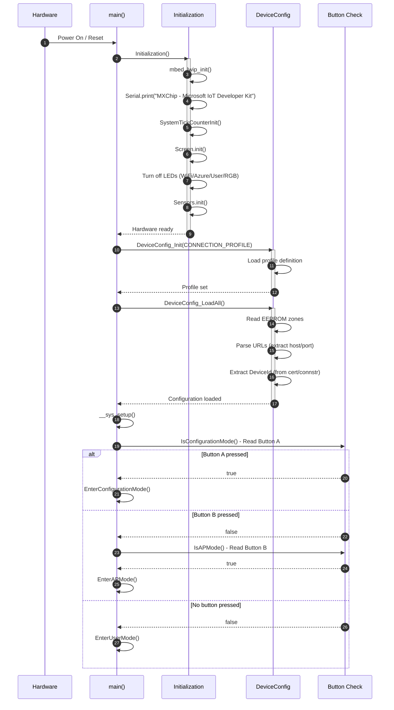
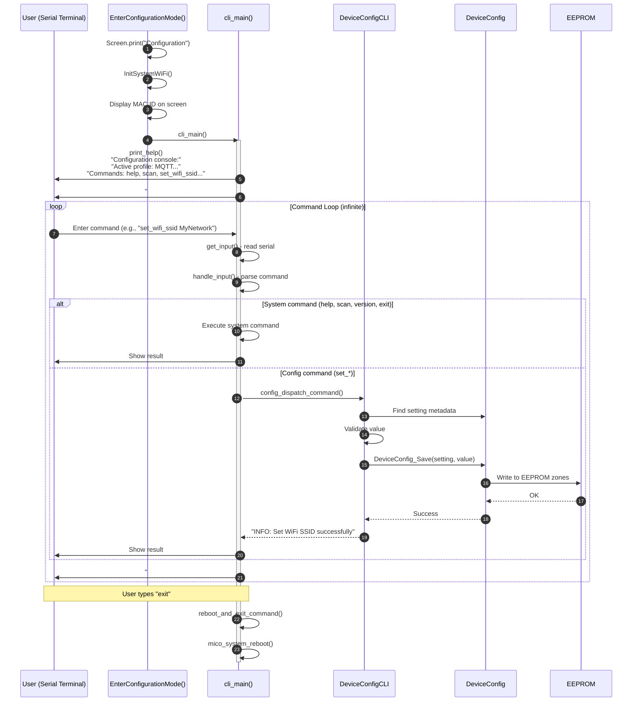
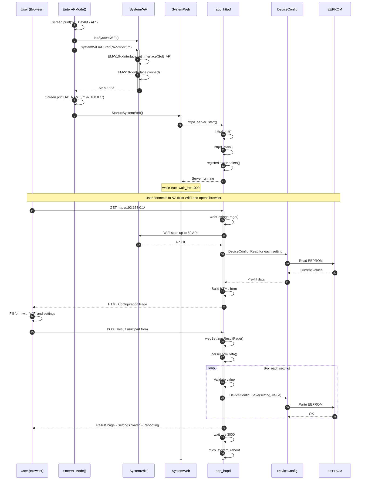
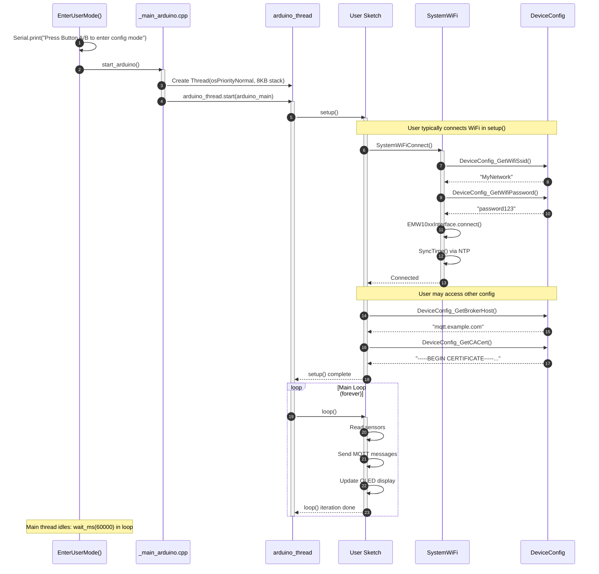
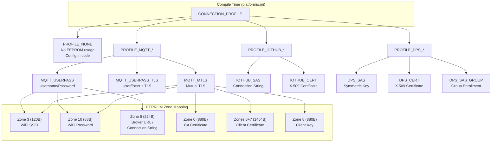
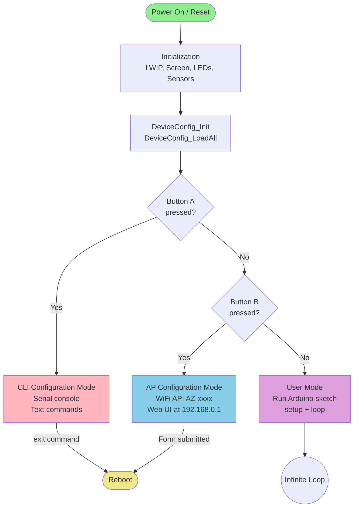

# MXChip IoT DevKit Boot Flow - Sequence Diagrams

This document describes the boot flow from power-on through the three possible operational modes. These diagrams render natively in GitHub, VS Code (with Markdown Preview), and most modern markdown viewers.

---

## 1. Main Boot Sequence (Power On)

---

## 2. CLI Configuration Mode (Button A Pressed)

When the user holds **Button A** during reset, the device enters serial CLI configuration mode.

### CLI Commands Available

| Command | Description |
|---------|-------------|
| `help` | Show all available commands |
| `version` | Show SDK/firmware versions |
| `scan` | Scan available WiFi networks |
| `status` | Show current configuration status |
| `set_wifi_ssid <value>` | Set WiFi SSID |
| `set_wifi_pass <value>` | Set WiFi password |
| `set_broker_url <value>` | Set MQTT broker URL |
| `set_device_id <value>` | Set device ID |
| `set_ca_cert "<PEM>"` | Set CA certificate (use `\n` for newlines) |
| `exit` | Save and reboot |

---

## 3. Web AP Configuration Mode (Button B Pressed)

When the user holds **Button B** during reset, the device creates a WiFi Access Point and serves a web configuration UI.

---

## 4. Normal User Mode (No Buttons Pressed)

When no buttons are pressed during boot, the device loads configuration and starts the user's Arduino sketch.

---

## 5. Configuration Profile System

---

## 6. Boot Decision Tree

---

## Summary

| Mode | Trigger | Interface | Purpose |
|------|---------|-----------|---------|
| **CLI Config** | Button A at boot | Serial terminal | Text-based configuration |
| **Web AP Config** | Button B at boot | WiFi AP + Browser | Form-based configuration |
| **User Mode** | No buttons | Arduino sketch | Normal operation |

All configuration is stored in **EEPROM** and persists across reboots. The active **profile** (set at compile time) determines which settings are available and how EEPROM zones are mapped.
